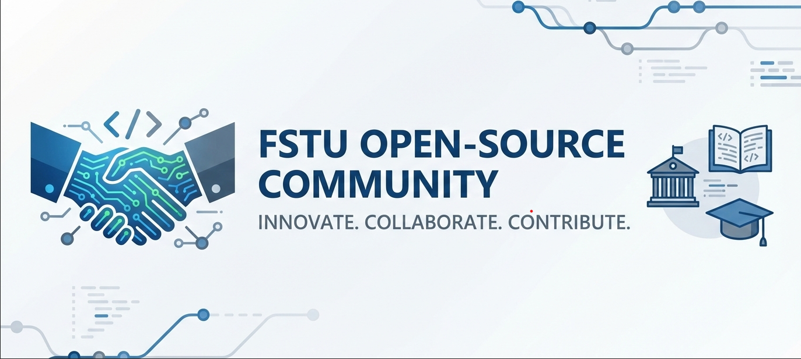

  

# FSTU Open Source 🚀

Welcome to the official open-source community of Fergana State Technical University.

We are a student-driven initiative focused on:
- 💡 Learning by building real projects
- 🤝 Open collaboration
- 🧠 Innovation through technology

---

## 🌍 What We Do

- Open-source student projects
- Research & AI experiments
- Educational tools
- University & community solutions

---

## 🛠️ Tech Stack

- Python / FastAPI
- JavaScript / TypeScript
- React / Vue
- AI & Machine Learning
- Mobile Development

---

## 🤝 How to Contribute

1. Fork a repository
2. Read the `CONTRIBUTING.md`
3. Create a feature branch
4. Open a Pull Request

No experience? No problem. We help beginners.

---

## 📢 Community

- Telegram: [https://t.me/FSTU_OpenSource]
- University: https://fstu.uz

---

> “The best way to learn is to build together.”
